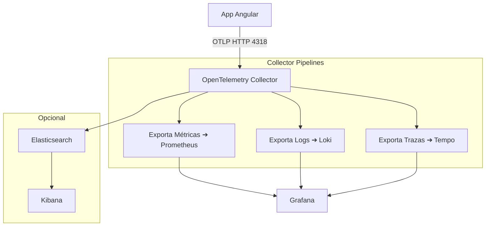

# ✨ Observabilidad con Grafana, Prometheus, Loki, Tempo y Elasticsearch + Kibana

Este entorno **Podman** te permite tener un stack completo de observabilidad para aplicaciones frontend (como Angular), con trazas, logs, métricas y opcionalmente Elasticsearch/Kibana como visor adicional. Se usa `podman-compose` para orquestar los contenedores.

---

## 🤖 Servicios Incluidos

| Servicio         | Puerto | Descripción                                                                 |
|------------------|--------|-----------------------------------------------------------------------------|
| Grafana          | `3000` | Visualización de métricas, logs y trazas. Datasources: Prometheus, Loki, Tempo. |
| Prometheus       | `9090` | Recolección de métricas desde el OTEL Collector.                            |
| Loki             | `3100` | Recolección de logs desde OTEL Collector (OTLP).                            |
| Tempo            | `3200` | Recolección y almacenamiento de trazas desde OTEL Collector.                |
| OTEL Collector   | `4318` | Punto de ingesta OTLP (HTTP) para logs, métricas y trazas.                   |
| Elasticsearch    | `9200` | Almacenamiento de datos estructurados (opcional).                            |
| Kibana           | `5601` | Exploración de datos en Elasticsearch (opcional).                            |

---

## 🚀 Iniciar el entorno en local

```bash
# Clonar el proyecto (si aplica)
git clone <repo-url>
cd <directorio>

# Iniciar los contenedores
podman-compose down
podman-compose up -d
```

Verifica en el navegador:

- Grafana: [http://localhost:3000](http://localhost:3000)
- Prometheus: [http://localhost:9090](http://localhost:9090)
- Tempo: [http://localhost:3200](http://localhost:3200)
- Loki: [http://localhost:3100](http://localhost:3100)
- Elasticsearch: [http://localhost:9200](http://localhost:9200)
- Kibana: [http://localhost:5601](http://localhost:5601)

---

## 🌍 Flujo de datos (Mermaid)



---

## 📃 Archivos importantes

 - `podman-compose.yml`: define todos los servicios.
- `otel-collector-config.yml`: configura los pipelines del OTEL Collector.
- `prometheus.yml`: configuración de scrape para Prometheus.
- `tempo.yml`, `loki.yml`, `dashboards.yml`: provisioning para Grafana.

---

## 🔧 Enviar datos desde Angular

En tu app Angular puedes usar `@opentelemetry/sdk-trace-web` y `@opentelemetry/exporter-trace-otlp-http` para enviar trazas. Asegúrate de apuntar al endpoint:

```
http://localhost:4318/v1/traces
```

Logs y métricas pueden ser enviados desde el backend o con wrappers personalizados.

Al iniciar sesión en la aplicación se obtiene un token (por ejemplo un JWT) que
se almacena en `localStorage` bajo la clave `auth_token`. Dicho token se usa
posteriormente para firmar las peticiones de los exportadores OTLP.

---

## 🔐 Accesos por defecto

- **Grafana**: `admin` / `admin`
- **Kibana**: No requiere login (seguridad desactivada)

---

## 🔑 Variables de entorno para OIDC

Para habilitar la autenticación OIDC en el OTEL Collector se deben definir las
siguientes variables antes de levantar los contenedores:

- `OIDC_ISSUER_URL`: URL del servidor de identidad (por ejemplo
  `http://<auth-server>/realms/<realm>`).
- `OIDC_AUDIENCE`: Audiencia esperada para el collector, normalmente
  `otel-collector`.

Estas variables son usadas por el autenticador `oidc` configurado en
`podman/otel-collector-config.yml`.


